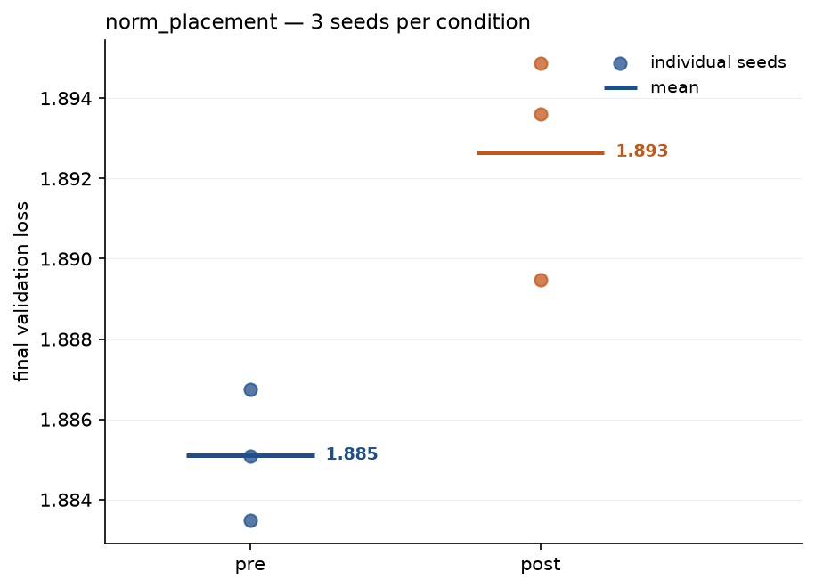
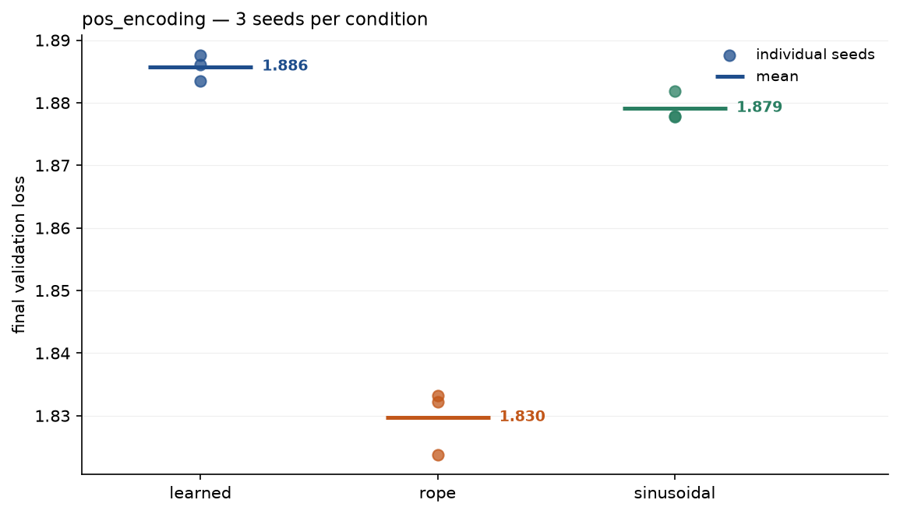
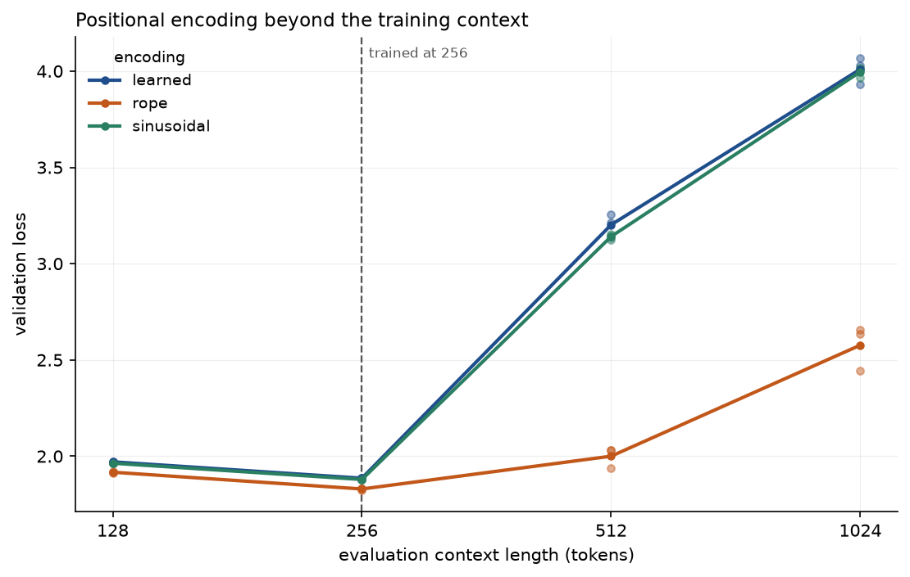
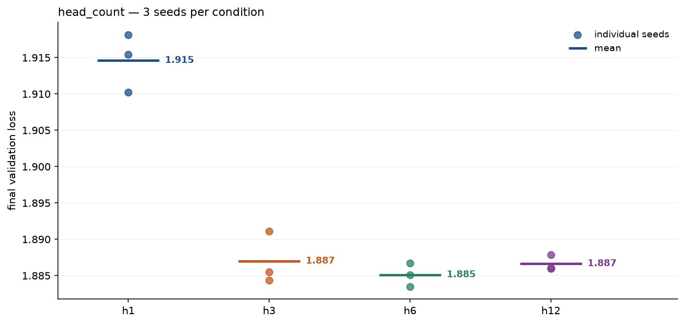

# FINDINGS — transformer-ablations

Three ablation studies on a 13.89M-parameter decoder trained from scratch on TinyStories.
Each hypothesis was written down in [DESIGN.md §6](DESIGN.md) *before* the runs started;
this document reports what the data said, including where it disagreed.

Two of the three hypotheses were wrong in some part. Those parts are the interesting ones.

## Method

Identical across every run in the sweep:

| | |
|---|---|
| Architecture | 6 layers, `d_model` 384, context 256, weight-tied head |
| Parameters | 13,891,584 (learned / head-count conditions), 13,793,280 (sinusoidal, RoPE) |
| Corpus | TinyStories, 466.8M tokens, BPE vocab 8,192, document-level split |
| Budget | 50M tokens per run (~6,100 steps at batch 32) |
| Seeds | 3 per condition (0, 1, 2) — 9 conditions, 27 runs |
| Hardware | Apple M4 Pro, 24 GB unified memory, MPS backend |

Each condition changes exactly one thing against the same baseline. Everything reported is
final validation loss on the held-out split, in nats per token.

**"Spread" means max − min across the three seeds.** Three seeds do not support a
confidence interval, and none is claimed. The spread is the smallest honest noise floor
available: a gap between conditions that is not clearly larger than it is not a result.
Every mean below is reported with its spread for exactly that reason, and the
per-condition values are in [`runs/results.jsonl`](runs/results.jsonl).

Reproduce any number here from a clean clone:

```bash
python -m minigpt.analysis table                      # the result tables
python -m minigpt.analysis study --study head_count    # one study's chart
python -m minigpt.analysis context-scaling             # the A2 length chart
```

---

## A1 — Layer-norm placement: pre-norm vs post-norm

**Hypothesis.** Post-norm trains less stably at this depth and lands at higher validation
loss; removing warmup widens the gap.

**Result.**

| condition | mean | spread | seeds |
|---|---|---|---|
| pre | **1.8851** | 0.0033 | 1.8835, 1.8851, 1.8867 |
| post | 1.8926 | 0.0054 | 1.8895, 1.8936, 1.8949 |



**Verdict: directionally confirmed, and far weaker than predicted.**

Pre-norm wins by 0.0075 nats. The two condition ranges do not overlap — every pre-norm
seed beat every post-norm seed — so the direction is real and not an artifact of which
seeds were drawn. But 0.0075 is only about twice the seed spread. This is a small effect
measured cleanly, not the clear separation the hypothesis expected.

The instability half of the hypothesis did not happen at all. All six runs completed, none
produced a NaN, none needed the divergence handling the sweep carries for exactly this
case, and the loss curves are the same shape. Post-norm at six layers is slightly worse,
not fragile.

**The warmup arm was never run.** "Removing warmup widens the gap" remains untested — it
was tied to the A4 stretch study, which the sweep budget did not reach. It is not reported
here as either supported or refuted.

**What it means.** This result does *not* explain why every modern decoder is pre-norm. The
textbook reason is gradient behaviour in deep stacks, and six layers is nowhere near deep
enough to show it — the honest reading is that at this depth the choice barely matters, and
the real argument for pre-norm lives at depths this project cannot afford to train. A
writeup claiming this data vindicates pre-norm would be overselling a 0.0075-nat gap.

---

## A2 — Positional encoding: learned vs sinusoidal vs RoPE

*The headline study.*

**Hypothesis.** The three are close at the training context, but at evaluation contexts
longer than training, learned encodings collapse while RoPE degrades gracefully.

### At the training context (256)

| condition | mean | spread | seeds |
|---|---|---|---|
| rope | **1.8297** | 0.0094 | 1.8238, 1.8322, 1.8332 |
| sinusoidal | 1.8791 | 0.0041 | 1.8777, 1.8778, 1.8818 |
| learned | 1.8858 | 0.0041 | 1.8835, 1.8861, 1.8876 |



### Beyond it — validation loss against evaluation context

Trained at 256; evaluated at 0.5x, 1x, 2x and 4x that length. Means across three seeds,
from [`runs/context_eval.jsonl`](runs/context_eval.jsonl).

| context | learned | sinusoidal | rope |
|---|---|---|---|
| 128 | 1.9708 | 1.9637 | 1.9170 |
| **256** (trained) | 1.8858 | 1.8791 | **1.8297** |
| 512 | 3.2019 | 3.1408 | **2.0001** |
| 1024 | 4.0100 | 3.9965 | **2.5769** |

Penalty against each condition's own loss at the training context:

| context | learned | sinusoidal | rope |
|---|---|---|---|
| 512 | +1.3161 | +1.2617 | **+0.1704** |
| 1024 | +2.1242 | +2.1174 | **+0.7472** |



**Verdict: the extrapolation claim is confirmed, but not for the reason the hypothesis gave.
RoPE wins at the training context too, which it was not expected to.**

RoPE is the only condition that survives past the training context. At 2x it gives up 0.17
nats; at 4x it is still better (2.5769) than either absolute encoding manages at 2x. Both
absolute encodings fall off a cliff: at 2x, learned loses 1.32 nats and sinusoidal 1.26,
which puts a fully trained model back at the loss the baseline run passed through around
step 450 of 6,104 — roughly 4M tokens into a 50M-token budget. At 4x both are worse than
the baseline at step 246.

**Sinusoidal is what makes this a mechanism and not just an observation.** The obvious
explanation for learned collapsing is that positions 256–511 were never seen in training,
so their rows are still at initialisation — an untrained-parameter story. Sinusoidal has no
untrained rows to blame. Its table is a closed-form function of position, defined at every
index, identical at position 900 whether or not the model ever trained there. It collapses
anyway, and to within 0.06 nats of learned at both lengths.

So the untrained-rows account is wrong, or at least not necessary. What the two failing
conditions share is that position enters the model as a vector *added to the token
embedding*, carrying absolute position. Attention over those representations has no reason
to behave sensibly when the absolute indices run past anything it has seen, whether the
encoding of those indices was learned or derived. RoPE instead rotates queries and keys so
that attention depends on the *difference* between positions, and a difference of 40 tokens
looks the same at index 900 as at index 90.

The hypothesis's other half was simply wrong: the three are not close at the training
context. RoPE wins by 0.0494 over sinusoidal and 0.0561 over learned, roughly 12-14x the
0.0041 seed spread both absolute conditions show. RoPE is not a robustness tax paid for
length generalisation — it is better at the length you trained on as well, which is the more
practically useful of the two findings.

Between the two absolute encodings, sinusoidal edges learned by 0.0067 nats at the training
context — above both of their 0.0041 spreads, so probably real, but small. Since the fix
equalises their positional share at initialisation (50.00% learned, 49.88% sinusoidal), what
remains is a comparison of trainability, and a fixed sinusoidal basis is apparently a hair
better than a learned table at this budget. With n=3 and a gap that size, "roughly
equivalent, with no advantage to making it learnable" is as much as the data supports.

Worth naming as a confound in RoPE's favour: the learned condition carries 98,304 *more*
parameters than RoPE and sinusoidal (the 256 × 384 position table), 0.7% of the model, and
still loses on both axes.

All three are worse at 128 than at 256, which is expected and not a finding — half the
context means less evidence per prediction.

### The sinusoidal numbers above are the second set, and the first set was a bug

The sweep's original sinusoidal runs came out at **2.6397** (spread 0.1585) — about 0.75
nats behind learned, which reads as a clean, reportable finding: "the fixed sinusoidal basis
is much worse than a learned table." It was an implementation bug, and the three runs were
redone on the fix. Same code path, same seeds, same budget: **1.8791** (spread 0.0041).

The raw table from the paper has per-component RMS 1/sqrt(2) ≈ 0.707, while token
embeddings initialise at std 0.02. Added straight onto the embedding, the position signal
outweighed token identity 35x and carried **99.92%** of the energy entering the first
block. Every sinusoidal run spent its budget digging the token identity out from underneath
its own position encoding. The fix scales the table to the embedding's initialisation std,
which equalises positional share at 50.00% / 49.88% and makes the condition a test of
trainability rather than of amplitude.

**The tell was the variance, not the mean.** A spread of 0.1585 where every other condition
in the sweep sits between 0.0019 and 0.0094 is the signature of a broken condition. The mean
on its own was entirely plausible and nothing else contradicted it — `test_loss_at_init`
passed throughout, because the final LayerNorm strips the overall scale before the tied head
sees it, so a model with a 35x position signal still scores near ln(8192) at step 1.

That is the methodological point worth keeping from this project: the bug was caught by a
condition being an outlier in *both* mean and seed spread, and it would not have been caught
by reading means alone. Three seeds per condition cost three times the compute and are the
only reason the error surfaced before the writeup.

The 0.75 nats it fabricated also pointed the wrong way about mechanism. On the bugged runs,
sinusoidal looked like a weak encoding; corrected, it is within 0.007 of learned at the
training context and collapses identically beyond it, which is what turns A2's result from
"learned embeddings have untrained rows" into "absolute position does not extrapolate."

---

## A3 — Head count at fixed width

**Hypothesis.** One head is clearly worse; returns diminish sharply past 6; parameter count
is identical across conditions, so any difference is attributable to attention structure
alone.

**Result.** Parameter count verified identical at 13,891,584 for all four conditions.

| condition | mean | spread | seeds |
|---|---|---|---|
| h1 | 1.9146 | 0.0080 | 1.9102, 1.9154, 1.9182 |
| h3 | 1.8870 | 0.0067 | 1.8844, 1.8855, 1.8911 |
| h6 | **1.8851** | 0.0033 | 1.8835, 1.8851, 1.8867 |
| h12 | 1.8866 | 0.0019 | 1.8860, 1.8860, 1.8879 |



**Verdict: first claim confirmed, second claim wrong in its detail.**

One head costs 0.0295 nats against six — four to nine times the seed spreads, and the
largest clean effect in the whole sweep. With `d_model` fixed, a single 384-dimensional
head has exactly the parameters of twelve 32-dimensional ones and still loses, so this is
attributable to attention structure rather than capacity. Splitting the representation into
subspaces that attend to different positions is doing real work.

But returns do not diminish "past 6" — they are gone by 3. h3, h6 and h12 span 0.0019 nats,
no larger than the smallest of their own seed spreads; h12 is nominally *worse* than h6 and the ordering
between those three is not meaningful. The honest statement is that three heads is enough
at this width, and the hypothesis picked 6 as the elbow because 6 was the baseline, which is
reasoning backwards from the default.

**What it means.** The useful quantity is probably head dimension, not head count: at
`d_model` 384, h3 gives 128 dimensions per head and h12 gives 32, and both train to the
same loss, so the binding constraint is somewhere below 32 dimensions rather than at any
particular number of heads. Testing that would need `d_model` varied as well, which is a
different study.

---

## What this licenses, and what it does not

Every number here comes from 13.89M parameters, 50M tokens, one synthetic corpus of short
children's stories, and three seeds. Conclusions at this scale may not hold at any other —
TinyStories in particular has simple, local syntax, which plausibly understates how much
long-range positional machinery matters.

Taking that seriously, by how much I would trust each result:

- **RoPE's length extrapolation (A2).** The effect is an order of magnitude larger than the
  noise, and the mechanism — relative phase versus absolute position — does not depend on
  scale. Sinusoidal is the reason I would bet on this one: two absolute encodings with
  completely different parameterisations fail the same way by the same amount, which is what
  a mechanism looks like rather than a coincidence of one implementation.
- **One head is worse (A3).** Large, clean, and parameter-controlled. Likely holds.
- **Three heads is enough (A3).** Holds *at this width*. Says nothing about 12 heads at
  `d_model` 768.
- **Pre-norm beats post-norm (A1).** Real but tiny here, and the mechanism that makes it
  matter elsewhere is depth this project does not have. Would not generalise this number.

## Cost

38.7 hours of wall clock for the 27 runs as recorded, plus about 9 hours of sinusoidal runs
that were thrown away with the bug, so roughly 48 hours spent to produce 19 hours of
compute. A run is ~41 minutes at the ~20,000 tok/s the sweep sustained, itself well below
the 31,202 tok/s the baseline managed on an idle machine; the three reruns alone ranged from
15,800 to 26,046 tok/s depending on what else was running.

The rest went to thermal pacing, which deliberately trades wall clock for a quieter laptop,
and to automatic holds while the machine was on battery. Both are scientifically inert —
same batches, same data order, same gradients, verified bit-identical — so a paced run
produces the result an unpaced one would have. See [NOTES.md](NOTES.md) for how that was
established.

The 9 discarded hours are the real cost of the position-scale bug, and they are cheap next
to shipping the writeup with a fabricated 0.75-nat finding in it.

$0 of paid compute, as required.
