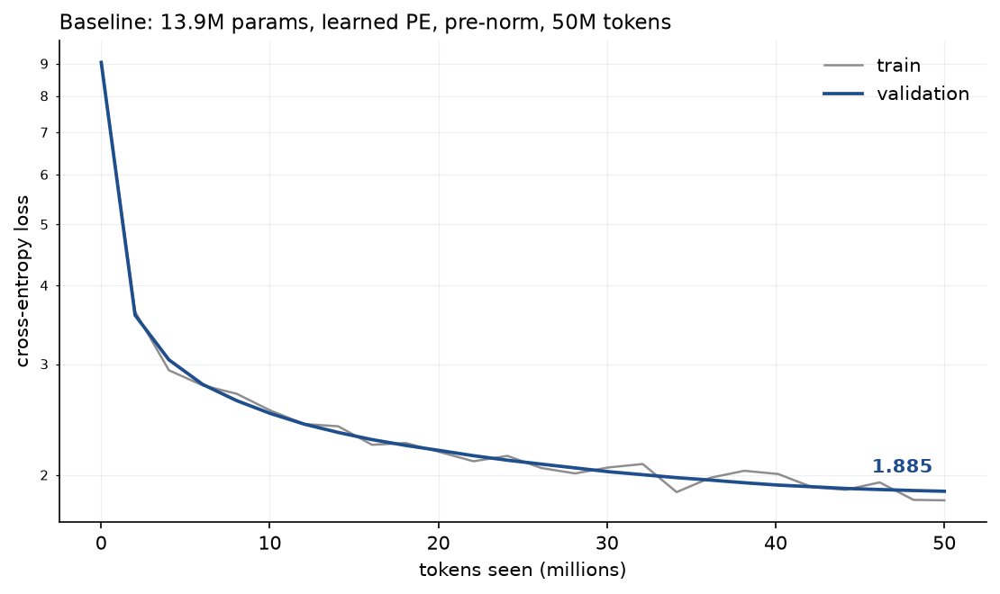

# transformer-ablations

A GPT-style decoder-only transformer implemented from scratch in PyTorch, trained at
roughly 14M parameters, used to run **controlled ablations on architectural choices** —
with multiple seeds per condition and variance reported honestly.

> **Status: baseline trained; the ablation sweep has not run yet.**
> A 13.9M-parameter model reaches **1.885 validation loss** on TinyStories in 26.7
> minutes on a laptop, and writes coherent English. Ablation results land next; see
> [PLAN.md](PLAN.md) for where the project is.

## What this is

Implementing a transformer is commodity work; there are thousands of public repos that do
it. The point of this one is the **experimental method layered on top**:

- Every ablation dimension is a **config flag on a single model class**, never a code
  fork — so conditions cannot silently diverge in some unrelated way.
- Runs are budgeted in **tokens processed**, not epochs or steps, so conditions with
  different batch shapes still see identical data volume.
- **Every condition runs on at least three seeds.** Charts plot individual seeds
  alongside the mean. If the seeds disagree about which condition wins, the chart says so.
- Attention is computed from primitives and **tested for numerical equivalence** against
  `F.scaled_dot_product_attention`, so "from scratch" is a verified claim rather than an
  assertion.

## Baseline



| | |
|---|---|
| Validation loss | **9.045 → 1.885** |
| Tokens | 50,003,968 (6,104 steps) |
| Wall clock | 26.7 min at 31,202 tok/s |
| Hardware | Apple M4 Pro, MPS, $0 |

Train and validation track each other the whole way — no overfitting, which is expected
when a run sees only 10.7% of the corpus. This is the reference every ablation condition
is measured against.

Unprompted sample, temperature 0.8, top-k 50:

> Once upon a time there was a girl named Daisy. Daisy had lots of friends. One day,
> Daisy was feeling really shy. She had never tried to help her friends so she was not
> being brave. She decided to go to the beach.
>
> When she got there, Daisy was so excited! She saw lots of water, trees and shells and
> creatures. Daisy wanted to show her friends, so she started running around the beach.
> She ran around and around and felt so brave.

Grammatical, with narrative structure and consistent characters across paragraphs. It
also loses track of things — a bird named Bunny becomes a Bear a few lines later — which
is what 13.9M parameters buys.

## Planned studies

| Study | Question | Hypothesis |
|---|---|---|
| **A1 — norm placement** | Pre-norm vs post-norm | Post-norm trains less stably at this depth; the gap widens without LR warmup |
| **A2 — positional encoding** | Learned vs sinusoidal vs RoPE | Close at the training context; beyond it, learned encodings collapse while RoPE degrades gracefully |
| **A3 — head count** | 1 / 3 / 6 / 12 heads at fixed `d_model` | 1 head is clearly worse, returns diminish past 6 — parameter count held identical, so differences are attributable to attention structure alone |

## Planned setup

- **Model** — 6 layers, 6 heads, `d_model` 384, context 256, 8,192-token BPE vocabulary
  (≈ 13.9M parameters)
- **Corpus** — TinyStories, chosen so a model this small still produces coherent English
- **Hardware** — Apple M4 Pro (24 GB unified memory), MPS. Code is device-agnostic across
  `cuda | mps | cpu`
- **Cost** — $0. Local hardware only

Deliberately not used: HuggingFace `transformers`, Lightning, Hydra, Accelerate. Their
presence would undercut the claim the project exists to make.

## Documents

- [REQUIREMENTS.md](REQUIREMENTS.md) — what it must do, non-goals, assumptions
- [DESIGN.md](DESIGN.md) — components, data contracts, trade-offs, test strategy
- [PLAN.md](PLAN.md) — milestones, risk register, sequence
- [NOTES.md](NOTES.md) — decisions and why they were made

## Setup

Requires Python 3.11+ and [uv](https://docs.astral.sh/uv/).

```bash
uv venv --python 3.11 && uv pip install -e ".[dev]"
uv run pytest        # 138 tests, ~7s, no network
uv run ruff check .
```

The tests assert what this README claims about the environment — the Python and torch
floors, and the presence of the ops the model depends on — so a mismatch fails in a
second rather than forty minutes into a training run.

Build the corpus (downloads ~1 GB, takes about 2 minutes):

```bash
uv run python -m minigpt.data prepare
uv run python -m minigpt.data inspect   # metadata plus a decoded sample
```

That produces **466.8M training tokens and 4.7M validation tokens** at vocab 8,192 —
4.12 characters per token. A 50M-token ablation run sees 10.7% of the corpus and the
200M flagship sees 42.8%, so no run repeats data. Corpus and checkpoints stay out of git;
rebuild them with the command above.

Train, sample, and chart:

```bash
uv run python -m minigpt.train --token-budget 50000000 --run-name baseline-50M
uv run python -m minigpt.sample --run runs/baseline-50M --prompt "Once upon a time"
uv run python -m minigpt.analysis loss-curve --run runs/baseline-50M
uv run python -m minigpt.analysis summary --run runs/baseline-50M
```

Runs are budgeted in tokens rather than epochs, so two conditions with different batch
shapes still see identical data. Each writes `metrics.jsonl`, `config.json` with git
provenance, and a checkpoint into `runs/<name>/`. A completed run is skipped rather than
redone, which is what makes an interrupted overnight sweep resumable.

Run the ablations:

```bash
uv run python -m minigpt.experiments list            # studies and their hypotheses
uv run python -m minigpt.experiments run             # all 27 runs, ~12 h
uv run python -m minigpt.experiments run --study head_count
```

A failing run is recorded and the sweep continues — one bad condition costs one run, not
a night. Rerunning skips finished runs, but refuses to skip any whose config has changed,
so one study name can never hold results from two configurations.

## Measured cost

Everything below was measured on one laptop. No cloud, no spend.

| | |
|---|---|
| Sustained throughput | **31,202 tok/s** (d384 / L6 / H6, batch 32, fp32) |
| Peak memory | 3.5 GB of 24 GB |
| One ablation run (50M tokens) | 26.7 min |
| Full 27-run sweep | ~12 h |
| Flagship run (200M tokens) | ~1.8 h |
| **Total project compute** | **~14 hours**, all overnight |

Earlier benchmarks put throughput at 23,500 tok/s, but those were measured while other
work ran on the same machine. The figure above comes from an uninterrupted half-hour run,
which is what the sweep will actually experience.

Every op the design needs runs on MPS, including complex64 multiply for RoPE and both
autocast dtypes. No CUDA fallback is required.

## Reproduction

Commands for regenerating each figure land with the runs that produce them. Every figure
in the final writeup will be reproducible from a clean clone, with the hardware and
wall-clock cost stated honestly rather than omitted.
